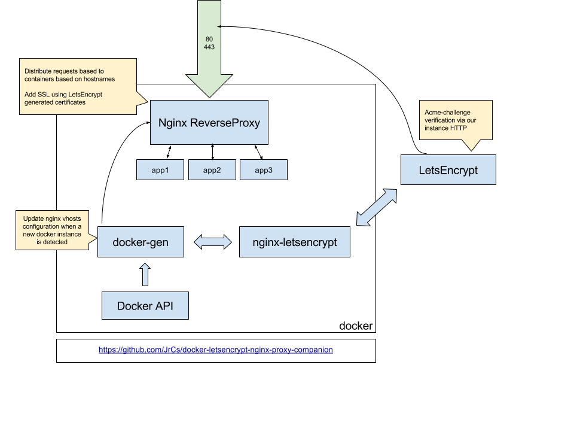

[](https://travis-ci.org/JrCs/docker-letsencrypt-nginx-proxy-companion)
[](https://github.com/JrCs/docker-letsencrypt-nginx-proxy-companion/releases)
[](https://hub.docker.com/r/jrcs/letsencrypt-nginx-proxy-companion "Click to view the image on Docker Hub")
[](https://hub.docker.com/r/jrcs/letsencrypt-nginx-proxy-companion "Click to view the image on Docker Hub")
[](https://hub.docker.com/r/jrcs/letsencrypt-nginx-proxy-companion "Click to view the image on Docker Hub")

letsencrypt-nginx-proxy-companion is a lightweight companion container for the [nginx-proxy](https://github.com/jwilder/nginx-proxy). It allows the creation/renewal of Let's Encrypt certificates automatically. See [Let's Encrypt section](#lets-encrypt) for configuration details.

### Features:
* Automatic creation/renewal of Let's Encrypt certificates using original nginx-proxy container.
* Support creation of Multi-Domain ([SAN](https://www.digicert.com/subject-alternative-name.htm)) Certificates.
* Automatically creation of a Strong Diffie-Hellman Group (for having an A+ Rate on the [Qualsys SSL Server Test](https://www.ssllabs.com/ssltest/)).
* Work with all versions of docker.

***NOTE***: The first time this container is launched it generates a new Diffie-Hellman group file. This process can take several minutes to complete (be patient).



#### Usage

To use it with original [nginx-proxy](https://github.com/jwilder/nginx-proxy) container you must declare 3 writable volumes from the [nginx-proxy](https://github.com/jwilder/nginx-proxy) container:
* `/etc/nginx/certs` to create/renew Let's Encrypt certificates
* `/etc/nginx/vhost.d` to change the configuration of vhosts (needed by Let's Encrypt)
* `/usr/share/nginx/html` to write challenge files.

Example of use:

* First start nginx with the 3 volumes declared:
```bash
$ docker run -d -p 80:80 -p 443:443 \
    --name nginx-proxy \
    -v /path/to/certs:/etc/nginx/certs:ro \
    -v /etc/nginx/vhost.d \
    -v /usr/share/nginx/html \
    -v /var/run/docker.sock:/tmp/docker.sock:ro \
    --label com.github.jrcs.letsencrypt_nginx_proxy_companion.nginx_proxy \
    jwilder/nginx-proxy
```
The "com.github.jrcs.letsencrypt_nginx_proxy_companion.nginx_proxy" label is needed so that the letsencrypt container knows which nginx proxy container to use.

* Second start this container:
```bash
$ docker run -d \
    -v /path/to/certs:/etc/nginx/certs:rw \
    -v /var/run/docker.sock:/var/run/docker.sock:ro \
    --volumes-from nginx-proxy \
    jrcs/letsencrypt-nginx-proxy-companion
```

Then start any containers you want proxied with a env var `VIRTUAL_HOST=subdomain.youdomain.com`

    $ docker run -e "VIRTUAL_HOST=foo.bar.com" ...

The containers being proxied must [expose](https://docs.docker.com/reference/run/#expose-incoming-ports) the port to be proxied, either by using the `EXPOSE` directive in their `Dockerfile` or by using the `--expose` flag to `docker run` or `docker create`. See [nginx-proxy](https://github.com/jwilder/nginx-proxy) for more informations. To generate automatically Let's Encrypt certificates see next section.

#### Separate Containers
nginx proxy can also be run as two separate containers using the [jwilder/docker-gen](https://github.com/jwilder/docker-gen)
image and the official [nginx](https://hub.docker.com/_/nginx/) image.

You may want to do this to prevent having the docker socket bound to a publicly exposed container service (avoid to mount the docker socket in the nginx exposed container). It's better in a security point of view.

To run nginx proxy as a separate container you'll need:

1) To mount the template file [nginx.tmpl](https://github.com/jwilder/nginx-proxy/blob/master/nginx.tmpl) into the docker-gen container. You can get the latest official [nginx.tmpl](https://github.com/jwilder/nginx-proxy/blob/master/nginx.tmpl) with a command like:
```bash
curl https://raw.githubusercontent.com/jwilder/nginx-proxy/master/nginx.tmpl > /path/to/nginx.tmpl
```

2) Use the `com.github.jrcs.letsencrypt_nginx_proxy_companion.docker_gen` label on the docker-gen container, or explicitly set the `NGINX_DOCKER_GEN_CONTAINER` environment variable to the name or id of that container.

Examples:

* First start nginx (official image) with volumes:
```bash
$ docker run -d -p 80:80 -p 443:443 \
    --name nginx \
    -v /etc/nginx/conf.d  \
    -v /etc/nginx/vhost.d \
    -v /usr/share/nginx/html \
    -v /path/to/certs:/etc/nginx/certs:ro \
    --label com.github.jrcs.letsencrypt_nginx_proxy_companion.nginx_proxy \
    nginx
```

* Second start the docker-gen container with the shared volumes and the template file:
```bash
$ docker run -d \
    --name nginx-gen \
    --volumes-from nginx \
    -v /path/to/nginx.tmpl:/etc/docker-gen/templates/nginx.tmpl:ro \
    -v /var/run/docker.sock:/tmp/docker.sock:ro \
    --label com.github.jrcs.letsencrypt_nginx_proxy_companion.docker_gen \
    jwilder/docker-gen \
    -notify-sighup nginx -watch -wait 5s:30s /etc/docker-gen/templates/nginx.tmpl /etc/nginx/conf.d/default.conf
```

* Then start this container:
```bash
$ docker run -d \
    --name nginx-letsencrypt \
    --volumes-from nginx \
    -v /path/to/certs:/etc/nginx/certs:rw \
    -v /var/run/docker.sock:/var/run/docker.sock:ro \
    jrcs/letsencrypt-nginx-proxy-companion
```

* Then start any containers to be proxied as described previously.

Note:
If the 3 containers are using static names, both labels `com.github.jrcs.letsencrypt_nginx_proxy_companion.nginx_proxy` on nginx container and `com.github.jrcs.letsencrypt_nginx_proxy_companion.docker_gen` on the docker-gen container can be removed.

The docker environment variables to be set on the letsencrypt container are:
* `NGINX_PROXY_CONTAINER` set to the name of the nginx container (here `nginx`)
* `NGINX_DOCKER_GEN_CONTAINER` set to the name of the docker-gen container (here `nginx-gen`)

Example:
```bash
$ docker run -d \
    --name nginx-letsencrypt \
    --volumes-from nginx \
    -v /path/to/certs:/etc/nginx/certs:rw \
    -v /var/run/docker.sock:/var/run/docker.sock:ro \
    -e NGINX_DOCKER_GEN_CONTAINER=nginx-gen \
    -e NGINX_PROXY_CONTAINER=nginx \
    jrcs/letsencrypt-nginx-proxy-companion
```


#### Let's Encrypt

To use the Let's Encrypt service to automatically create a valid certificate for virtual host(s), declare the `LETSENCRYPT_HOST` environment variable in each to-be-proxied application containers.

The `LETSENCRYPT_HOST` variable most likely needs to be set to the same value as the `VIRTUAL_HOST` variable and must be publicly reachable domains. Specify multiple hosts with a comma delimiter.

##### Example:
```bash
$ docker run -d \
    --name example-app \
    -e "VIRTUAL_HOST=example.com,www.example.com,mail.example.com" \
    -e "LETSENCRYPT_HOST=example.com,www.example.com,mail.example.com" \
    -e "LETSENCRYPT_EMAIL=foo@bar.com" \
    tutum/apache-php
```

**Note:** the `VIRTUAL_HOST` (and `LETSENCRYPT_HOST`) must be (a) reachable domain(s) for LetEncrypt to be able to validate the challenge and provide the certificate.

**Note on CAA**: Please ensure that your DNS provider answers correctly to CAA record requests. [If your DNS provider answer with an error, Let's Encrypt won't issue a certificate for your domain](https://letsencrypt.org/docs/caa/). Let's Encrypt do not require that you set a CAA record on your domain, just that your DNS provider answers correctly.

**Note on IPv6**: If the domain or subdomain you want to issue certificate for has an AAAA record set, Let's Encrypt will favor challenge validation over IPv6. [There is an IPv6 to IPv4 fallback in place but Let's Encrypt cannot guarantee it'll work in every possible case](https://github.com/letsencrypt/boulder/issues/2770#issuecomment-340489871), so bottom line is **if you are not sure of both your host and your host's Docker reachability over IPv6, do not advertise an AAAA record** or LE challenge validation might fail.

The following environment variables are optional and parameterize the way the Let's Encrypt client works.

##### Contact address

The `LETSENCRYPT_EMAIL` variable must be a valid email and will be used by Let's Encrypt to warn you of impeding certificate expiration (should the automated renewal fail) or for account recovery. It is strongly advised to provide a valid contact address using this variable.

##### Private key size

The `LETSENCRYPT_KEYSIZE` variable determines the size of the requested key (in bit, defaults to 4096).

##### Multi-domain ([SAN](https://www.digicert.com/subject-alternative-name.htm)) certificates
If you want to create multi-domain ([SAN](https://www.digicert.com/subject-alternative-name.htm)) certificates add the base domain as the first domain of the `LETSENCRYPT_HOST` environment variable (see [the example](#example) above).

##### Test certificates
If you want to create test certificates that don't have the 5 certs/week/domain limits define the `LETSENCRYPT_TEST` environment variable with a value of `true` (in the containers where you request certificates with `LETSENCRYPT_HOST`). If you want to do this globally for all containers, set `ACME_CA_URI` as described below.

##### Automatic certificate renewal
Every hour (3600 seconds) the certificates are checked and every certificate that will expire in the next [30 days](https://github.com/kuba/simp_le/blob/ecf4290c4f7863bb5427b50cdd78bc3a5df79176/simp_le.py#L72) (90 days / 3) are renewed.

##### Force certificates renewal
If needed, you can force a running letsencrypt-nginx-proxy-companion container to renew all certificates that are currently in use. Replace `nginx-letsencrypt` with the name of your letsencrypt-nginx-proxy-companion container in the following command:

```bash
$ docker exec nginx-letsencrypt /app/force_renew
```

##### Show certificates informations
To display informations about your existing certificates, use the following command:

```bash
$ docker exec nginx-letsencrypt /app/cert_status
```

As for the forced renewal command, replace `nginx-letsencrypt` with the name of your letsencrypt-nginx-proxy-companion container.

##### ACME account keys
By default the container will save the first ACME account key created for each ACME API endpoint used, and will reuse it for all subsequent authorizations and issuances requests made to this endpoint. This behavior is enabled by default to avoid running into Let's Encrypt account [rate limits](https://letsencrypt.org/docs/rate-limits/).

For instance, when using the default Let's Encrypt production endpoint, the container will save the first account key created for this endpoint as `/etc/nginx/certs/accounts/acme-v01.api.letsencrypt.org/directory/default.json` and will reuse it for future requests made to this endpoint.

If required, you can use multiple accounts for the same ACME API endpoint by using the `LETSENCRYPT_ACCOUNT_ALIAS` environment variable on your proxyed container. This instruct the letsencrypt_nginx_proxy_companion container to look for an account key named after the provided alias instead of `default.json`. For example, `LETSENCRYPT_ACCOUNT_ALIAS=client1` will use the key named `client1.json` in the corresponding ACME API endpoint folder for this proxyed container (or will create it if it does not exists yet).

Please see the **One Account or Many?** paragraph on [Let's Encrypt Integration Guide](https://letsencrypt.org/docs/integration-guide/) for additional informations.

If you want to disable the account key reutilization entirely, you can set the environment variable `REUSE_ACCOUNT_KEYS` to `false` on the letsencrypt_nginx_proxy_companion container. This creates a new ACME registration with a corresponding account key for each new certificate issuance. Note that this won't create new account keys for certs already issued before `REUSE_ACCOUNT_KEYS` is set to `false`. This is not recommended unless you have specific reasons to do so.

#### Optional container environment variables

Optional letsencrypt-nginx-proxy-companion container environment variables for custom configuration.

* `ACME_CA_URI` - Directory URI for the CA ACME API endpoint (default: ``https://acme-v01.api.letsencrypt.org/directory``). If you set it's value to `https://acme-staging.api.letsencrypt.org/directory` letsencrypt will use test servers that don't have the 5 certs/week/domain limits. You can also create test certificates per container (see [let's encrypt test certificates](#test-certificates))

For example

```bash
$ docker run -d \
    -e "ACME_CA_URI=https://acme-staging.api.letsencrypt.org/directory" \
    -v /path/to/certs:/etc/nginx/certs:rw \
    --volumes-from nginx-proxy \
    -v /var/run/docker.sock:/var/run/docker.sock:ro \
    jrcs/letsencrypt-nginx-proxy-companion
```

* `DEBUG` - Set it to `true` to enable debugging of the entrypoint script and generation of LetsEncrypt certificates, which could help you pin point any configuration issues.

* `REUSE_ACCOUNT_KEYS` - Set it to `false` to disable the account keys reutilization (see [ACME account keys](#acme-account-keys)).

* `REUSE_PRIVATE_KEYS` - Set it to `true` to make simp_le reuse previously generated private key for each certificate instead of creating a new one on certificate renewal. Recommended if you intend to use HPKP.

* The `com.github.jrcs.letsencrypt_nginx_proxy_companion.nginx_proxy` label - set this label on the nginx-proxy container to tell the docker-letsencrypt-nginx-proxy-companion container to use it as the proxy.

* The `com.github.jrcs.letsencrypt_nginx_proxy_companion.docker_gen` label - set this label on the docker-gen container to tell the docker-letsencrypt-nginx-proxy-companion container to use it as the docker-gen when it's split from nginx (separate containers).

* `DOCKER_PROVIDER` - Set this to change behavior on container ID retrieval. Optional. Current supported values:
  * No value (empty, not  set): no change in behavior.
  * `ecs` [Amazon ECS using ECS_CONTAINER_METADATA_FILE environment variable](http://docs.aws.amazon.com/AmazonECS/latest/developerguide/container-metadata.html)

* `DHPARAM_BITS` - Change the size of the Diffie-Hellman key generated by the container from the default value of 2048 bits. For example `-e DHPARAM_BITS=1024` to support some older clients like Java 6 and 7.

#### Examples:

If you want other examples how to use this container, look at:

* [Evert Ramos's Examples](https://github.com/evertramos/docker-compose-letsencrypt-nginx-proxy-companion) - using docker-compose version '3'
* [Karl Fathi's Examples](https://github.com/fatk/docker-letsencrypt-nginx-proxy-companion-examples)
* [More examples from Karl](https://github.com/pixelfordinner/pixelcloud-docker-apps/tree/master/nginx-proxy)
* [George Ilyes' Examples](https://github.com/gilyes/docker-nginx-letsencrypt-sample)
* [Dmitry's simple docker-compose example](https://github.com/dmitrym0/simple-lets-encrypt-docker-compose-sample)
* [Radek's docker-compose jenkins example](https://github.com/dataminelab/docker-jenkins-nginx-letsencrypt)
